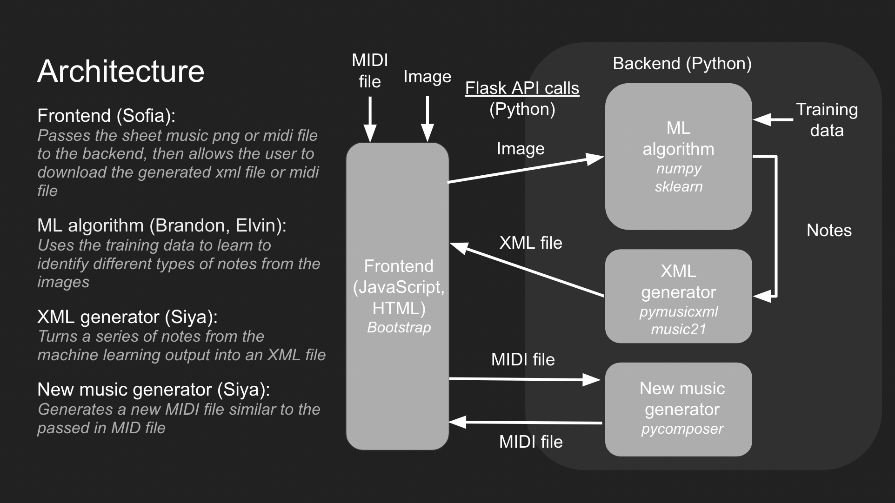

# SiteRead

## Introduction

Welcome to SiteRead!

SiteRead is an application to convert an image of printed or handwritten sheet music into a file compatible with online sheet music editors. SiteRead returns a musicxml file because most sheet music editing software allow for an upload of a musicxml file, including musescore, one of the most used free music editing softwares. Additionally, you can upload a midi file to our generator feature and a midi file will be returned matching the key and general feeling of the original piece.

Currently, no such application exists, that we are aware of, to convert handwritten sheetmusic to a digital format. The lack of many comprehensive data sets has limited the development of similar applications. There has been work done to create training image sets of handwritten notes but there is no datasets for labeling a note's key.

We got the idea for SiteRead because two members of our group are musicians who are frustrated that they can't easily convert their physical music into a digital format without using a music editing software to manually add all the notes.

## Technical Architecture

The general data flow through our application is that the user uploads an image of sheet music and it is passed to the backend through a flask API call, where it is processed, converted into an xml file, and returned. The processing of the image is done with a Naive Bayes algorithm which reads each note and finds the beats associated with the given note. Additionally, a statistical analysis is done on each note to find the head of the note and calculate which note on the staff that corresponds to. A musicxml file is then generated from the notes and sent back to the frontend for the user to download.

Our application was made primarily in Python with HTML, CSS and JavaScript used in the frontend.

The frontend uses Bootstrap stylization and components, such as loading bars.

The backend is Python and utilizes the numpy and scikit-learn packages for machine learning and note classification. The pymusicxml and music21 packages were used for musicxml generation.

For midi new music generation, a midi file is uploaded to the frontend and sent to the backend where it is used to train the GAN Composer and the composes new music in a midi file, which is returned to the frontend for the user to download. The midi generation utilizes the pycomposer packacge.

Below is an explanation of data flow through our application between frontend and backend.



## Installation Instructions

You can install all our dependencies with

```bash
pip install -r requirements.txt
```

Then, switch into our frontend folder and set up the Flask application.

```bash
cd frontend
export FLASK_APP=main_flask.py
```

To run the application, type

```bash
flask run
```

and open http://127.0.0.1:5000 in your browser of choice.

## Group Roles

Brandon: Worked on the backend, training the machine learning model and classifying notes.

Elvin: Worked on the backend, identifying the key of each note

Siya: Worked on the backend, converting notes classified by the model to an XML format and converting that to MIDI, and playing the output

Sofia: Worked on the frontend, designing the website and connecting it through flask to the python components the rest of the group worked on.
